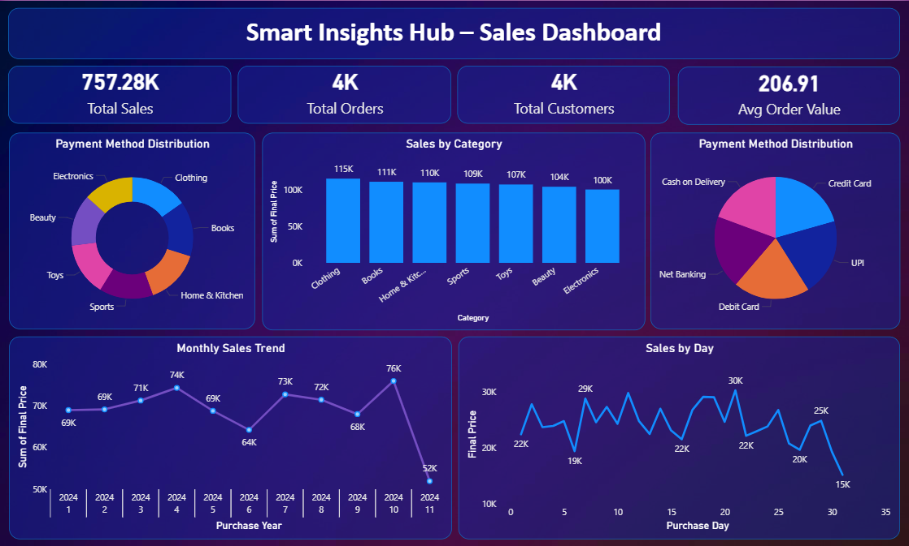

# 🚀 Smart Insights Hub: AI-Powered Data Analytics System

## 📌 Project Overview

**Smart Insights Hub** is a complete end-to-end machine learning and data analytics system that demonstrates professional data science practices. It loads, analyzes, and generates insights from e-commerce datasets using advanced preprocessing, visualization, and ML techniques.

### ✨ Key Features
- ✅ **Data Preprocessing**: Automated cleaning, transformation, and feature engineering
- ✅ **Exploratory Data Analysis**: Comprehensive visualizations and statistical analysis
- ✅ **Machine Learning**: Sales prediction (Linear Regression) + Customer segmentation (K-Means)
- ✅ **Insights Generation**: Automatic business intelligence from data patterns
- ✅ **Interactive Dashboard**: Power BI dashboard for data exploration and insights
- ✅ **Production-Ready Code**: Clean, modular, well-documented Python code

---

## 📁 Project Structure

```
Data Analyst Project/
├── main.py                      # Main orchestration file
├── data_preprocessing.py         # Data cleaning & feature engineering
├── eda.py                       # Exploratory data analysis & visualizations
├── model.py                     # ML models (Prediction & Clustering)
├── insights.py                  # Automatic insights generation
├── export_data.py               # Data export utilities
├── project-BI.pbix              # Power BI dashboard file
├── requirements.txt             # Python dependencies
├── README.md                    # This file
└── data/
    ├── ecommerce_dataset.csv    # E-commerce dataset
    └── processed_data.csv       # Processed dataset
```

---

## 🛠️ Installation

### 1. Prerequisites
- Python 3.8+
- pip (Python package manager)

### 2. Install Dependencies

```bash
pip install -r requirements.txt
```

**Dependencies:**
- pandas==2.0.3 - Data manipulation
- numpy==1.24.3 - Numerical computing
- matplotlib==3.7.2 - Visualization
- seaborn==0.12.2 - Statistical visualization
- scikit-learn==1.3.0 - Machine learning

---

## 🚀 Quick Start

### Run Complete Analysis Pipeline

```bash
python main.py
```

**This will:**
1. Load and preprocess the e-commerce dataset
2. Perform exploratory data analysis with visualizations
3. Train sales prediction model (Linear Regression)
4. Train customer segmentation model (K-Means)
5. Generate automatic business insights
6. Display summary statistics
7. Export processed data

**Expected Output:**
- Dataset preprocessing logs
- Statistical summaries
- Multiple visualization charts (will pop up in separate windows)
- Model performance metrics
- Business insights and recommendations

### View Dashboard in Power BI

Open the **`project-BI.pbix`** file in Microsoft Power BI Desktop or Power BI Online to:
- Visualize key metrics and KPIs
- Explore interactive dashboards
- Analyze sales trends and patterns
- Review customer segmentation insights
- Access detailed drill-down reports

---

## 📊 Data Pipeline Flow

```
Raw CSV Data
    ↓
[Data Preprocessing]
  - Load dataset
  - Handle missing values
  - Remove duplicates
  - Convert date formats
  - Feature engineering
    ↓
Cleaned & Processed Data
    ↓
    ├─→ [EDA] → Visualizations & Statistics
    │
    ├─→ [Sales Prediction Model]
    │     - Linear Regression
    │     - R² Score, MAE, RMSE
    │
    ├─→ [Customer Segmentation]
    │     - K-Means Clustering
    │     - 4 Customer Segments
    │
    └─→ [Insights Generation]
          - 8+ Automatic insights
          - Business recommendations
```

---

## 🔍 Module Descriptions

### `main.py`
**Purpose**: Orchestrates the entire pipeline

**Flow:**
1. Loads dataset
2. Runs preprocessing
3. Performs EDA
4. Trains ML models
5. Generates insights
6. Displays summary

**Run**: `python main.py`

### `data_preprocessing.py`
**Purpose**: Data cleaning and feature engineering

**Functions:**
- `load_data()` - Loads CSV file
- `handle_missing_values()` - Removes null values
- `remove_duplicates()` - Eliminates duplicate records
- `convert_date_columns()` - Converts strings to datetime
- `feature_engineering()` - Creates new features
- `preprocess_data()` - Main pipeline

**Features Created:**
- Purchase_Month, Purchase_Year, Purchase_Day
- Discount_Amount, Discount_Level

### `eda.py`
**Purpose**: Exploratory data analysis and visualizations

**Functions:**
- `show_summary_statistics()` - Descriptive statistics
- `plot_sales_by_category()` - Bar chart by category
- `plot_monthly_sales_trend()` - Line chart over time
- `plot_top_products()` - Top N products visualization
- `perform_eda()` - Main EDA pipeline

**Visualizations:**
- Sales distribution by category
- Monthly sales trends
- Top 10 performing products

### `model.py`
**Purpose**: Machine learning model implementation

**Classes:**
- `SalesPredictor` - Linear regression for price prediction
  - Trains on 80% data
  - Tests on 20% data
  - Reports R², MAE, RMSE
  
- `CustomerSegmentation` - K-Means clustering for customer groups
  - Creates 4 customer segments
  - Based on spending, frequency, discount usage
  - Visualizes clusters in 2D

### `insights.py`
**Purpose**: Automatic business insight generation

**Insights Generated:**
1. Highest sales category
2. Best performing month
3. Payment method preference
4. Discount impact analysis
5. Average order value
6. Top customer identification
7. Sales growth trend
8. Model performance summary
9. Customer segment characteristics

---

## 📈 Expected Results

### Data Preprocessing Output
```
✓ Dataset loaded! Shape: (rows, columns)
✓ Missing values handled
✓ Duplicates removed
✓ Features engineered successfully
```

### EDA Output
```
📊 Summary Statistics
- Numerical columns statistics
- Category distribution
- Payment method distribution

📊 Visualizations
- Sales by Category (Bar Chart)
- Monthly Sales Trend (Line Chart)
- Top 10 Products (Horizontal Bar)
```

### Model Output
```
🤖 Sales Prediction
- Training R² Score: ~0.85-0.95
- Testing R² Score: ~0.80-0.90
- MAE: ₹50-200
- RMSE: ₹100-300

👥 Customer Segmentation
- 4 distinct customer clusters identified
- Cluster sizes: 15-35% each
- Spending patterns visualized
```

### Insights Output
```
💡 Key Findings:
1. 🏆 Highest Sales Category: [Category Name]
2. 📈 Best Performing Month: [Month]
3. 💳 Payment Method Preference: [Method]
... (8+ more insights)
```

---

## 🎯 Model Details

### Sales Prediction (Linear Regression)
**Objective**: Predict final product price based on input features

**Features:**
- Original Price
- Discount Percentage
- Purchase Month/Year/Day
- Category (encoded)
- Payment Method (encoded)

**Performance Metrics:**
- R² Score: Measures variance explained (0-1)
- MAE: Average prediction error
- RMSE: Root mean squared error

**Use Cases:**
- Price estimation
- Discount impact analysis
- Revenue forecasting

### Customer Segmentation (K-Means)
**Objective**: Identify distinct customer groups for targeted marketing

**Features:**
- Total Spending
- Purchase Frequency
- Average Discount Usage

**Segments:**
1. **Cluster 0**: Low spending, low frequency
2. **Cluster 1**: High spending, high frequency (VIP)
3. **Cluster 2**: Medium spending, medium frequency
4. **Cluster 3**: Discount-focused customers

**Use Cases:**
- Targeted marketing campaigns
- Loyalty program design
- Customer retention strategies

---

## � Power BI Dashboard

The **`project-BI.pbix`** file contains an interactive Power BI dashboard that visualizes insights from the analyzed data.

### Dashboard Features
- **KPI Metrics**: Key performance indicators and summary statistics
- **Sales Analysis**: Sales trends, category performance, and revenue insights
- **Customer Insights**: Segmentation analysis and customer behavior patterns
- **Model Performance**: ML model metrics and predictions
- **Interactive Drill-through**: Click and explore detailed information
- **Filters & Slicers**: Dynamic filtering by date, category, and customer segments

### How to Access
1. **Desktop**: Open `project-BI.pbix` with Microsoft Power BI Desktop
2. **Online**: Publish to Power BI Service for cloud access and sharing
3. **Web**: Embed in websites or business applications

### Dashboard Sections
- 📈 **Overview**: High-level KPIs and summary metrics
- 🏪 **Sales Performance**: Category-wise sales and trends
- 👥 **Customer Segments**: Clustering analysis and segment characteristics
- 🤖 **Model Insights**: Prediction accuracy and model performance
- 📊 **Detailed Reports**: Drill-down analysis and detailed metrics

---
## 📸 Power BI Dashboard Screenshots

### Dashboard Overview



**Key Visualizations:**
- Main KPI cards showing top metrics
- Sales trend line chart
- Category performance bar charts
- Customer segmentation pie/donut charts
- Interactive slicers for filtering

**Example Insights Displayed:**
- Total Revenue and Orders
- Average Order Value (AOV)
- Sales by Category and Payment Method
- Customer Lifetime Value (CLV) by Segment
- Month-over-month growth rates

---
## �🐛 Troubleshooting

### Error: "ModuleNotFoundError: No module named 'pandas'"
**Solution**: Install dependencies
```bash
pip install -r requirements.txt
```

### Error: "FileNotFoundError: data/ecommerce_dataset.csv"
**Solution**: Ensure CSV file is in the `data/` folder
```bash
# Check file location
ls data/
```

### Error: "matplotlib figure not displaying"
**Solution**: Ensure matplotlib backend is configured for interactive use

---

## 📚 Code Quality

✅ **Clean Code Practices**
- Modular functions with single responsibility
- Clear documentation and docstrings
- Meaningful variable names
- Error handling

✅ **Professional Practices**
- Type hints in function signatures
- Logging and progress messages
- Configuration parameters
- Reproducible results (random_state)

✅ **Beginner-Friendly**
- Step-by-step comments
- Clear output messages with emojis
- Example usage in main blocks
- Comprehensive README

---

## 📊 Dataset Information

**Source**: E-commerce transaction data

**Columns:**
- User_ID: Customer identifier
- Product_ID: Product identifier
- Category: Product category
- Price (Rs.): Original price
- Discount (%): Discount percentage
- Final_Price(Rs.): Price after discount
- Payment_Method: Payment type
- Purchase_Date: Transaction date

**Statistics:**
- Records: 2,000+
- Categories: 7 (Electronics, Clothing, Sports, etc.)
- Date Range: January - December 2024
- Payment Methods: 4 types

---

## 🔄 Workflow Recommendations

### For Data Analysis
1. Run `python main.py` for initial analysis
2. Review generated visualizations
3. Check printed insights in console
4. Open `project-BI.pbix` in Power BI for interactive dashboard exploration

### For Model Improvement
1. Modify features in `data_preprocessing.py`
2. Adjust model parameters in `model.py`
3. Run `python main.py` to retrain
4. Compare metrics

### For Dashboard Enhancement
1. Update `project-BI.pbix` with new visualizations
2. Create calculated columns and measures using DAX
3. Design drill-through pages for deeper analysis
4. Publish to Power BI Service for sharing

### For Production Deployment
1. Export trained models to pickle files
2. Create API endpoints using Flask/FastAPI
3. Publish Power BI dashboard to Power BI Service or embed in web applications
4. Schedule daily retraining jobs

---

## 🚀 Future Enhancements

- Advanced ML models (XGBoost, Neural Networks)
- Time series forecasting (ARIMA, Prophet)
- Real-time data streaming
- A/B testing framework
- Custom SQL queries for deeper analysis
- Integration with business intelligence tools
- Automated report generation

---

## 📖 Learning Resources

- [Pandas Documentation](https://pandas.pydata.org/docs/)
- [Scikit-Learn Guide](https://scikit-learn.org/stable/)
- [Matplotlib Tutorial](https://matplotlib.org/stable/tutorials/)
- [Power BI Documentation](https://learn.microsoft.com/en-us/power-bi/)

---

## 📝 License & Credits

**Created as a professional data science demonstration project.**

Version: 1.0  
Last Updated: 2024  
Status: ✅ Production Ready

---

## 🤝 Support

For issues or questions:
1. Check the Troubleshooting section
2. Review function docstrings
3. Check console error messages
4. Verify file paths and data format

---

**Happy Analyzing! 🎉**

*Smart Insights Hub - Making data-driven decisions easier*
